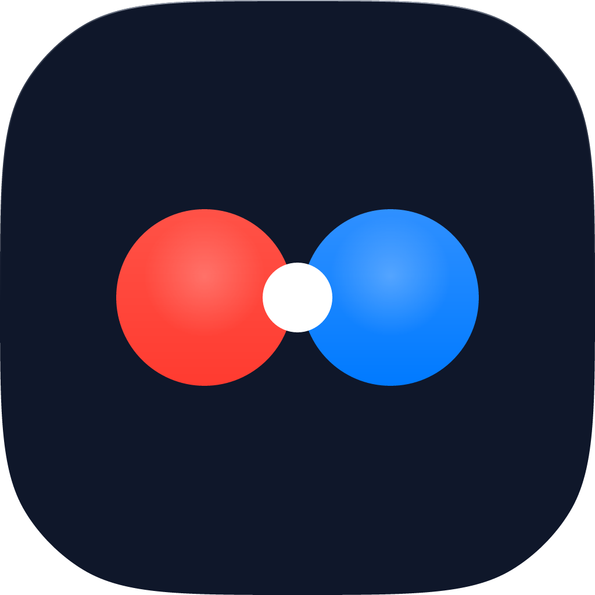

<div align="center">
  
  <h1>HQXBALL Desktop Client</h1>
  <p><b>High-performance, ultra-low latency desktop client engineered specifically for competitive players.</b></p>
  <br>
</div>

## 🚀 About the Project
**HQXBALL Desktop** is meticulously designed to completely eliminate chronic Canvas crashes, stalling, and "freeze" issues frequently encountered on standard web browsers (especially on modern Linux X11/Wayland and Windows environments).

By utilizing a rock-solid, stable **Electron 18.2.0** core, it provides an uncapped, zero input lag, and incredibly smooth (4000+ FPS) gaming experience. Step into a unique esports arena where only your skill matters.

## ✨ Key Features
* **Uncapped Performance:** Fixes modern Chromium VSYNC overrides, completely preventing hardware freezing at ultra-high refresh rates.
* **Apple-Style Quick Connect:** Press `F2` at any time during gameplay to open a sleek, GPU-friendly panel and connect to any HQXBALL room code at lightning speed.
* **Discord Integration (RPC):** Show off your current game status and statistics on your Discord profile in real-time. (If Discord is not installed, it safely bypasses without crashing).
* **Transparent & Secure:** Clean, auditable source code. No telemetry, no data collection, no third-party overlays. Everything runs locally.
* **Open Source & Transparency:** Backed by clean, reliable, and cheat-free code every step of the way.

## 📥 Download & Installation
To download ready-to-play packages without compiling, visit our [Releases](../../releases) page.
The following formats are automatically built for your systems:
- **Windows:** `.exe` / `.portable`
- **MacOS:** `.dmg` / `.zip`
- **Linux:** `.AppImage` / `.deb`

## 🛠️ Instructions for Developers
If you'd like to build the project on your own machine or contribute:

1. Clone the repository:
```bash
git clone https://github.com/imsinanulgen/hqxball-app.git
cd hqxball-app
```

2. Install dependencies (The specific Electron core will be downloaded):
```bash
npm install
```

3. Run in development mode (with uncapped flags applied):
```bash
npm start
```

4. Build distributable packages:
```bash
npm run dist
```

## 🌐 Community
Join us, support the project, or find players to match up with:
- **Website:** [www.hqxball.com](https://www.hqxball.com)
- **Discord:** [discord.gg/hqxball](https://discord.gg/hqxball)
